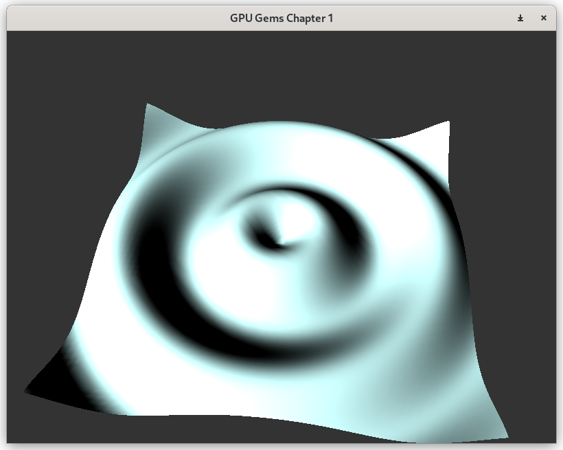

# Chapter 1

"[Effective Water Simulation from Physical Models](https://developer.nvidia.com/gpugems/gpugems/part-i-natural-effects/chapter-1-effective-water-simulation-physical-models)" from GPU Gems

A realtime solution for accumulative sine waves for water surface simulation

