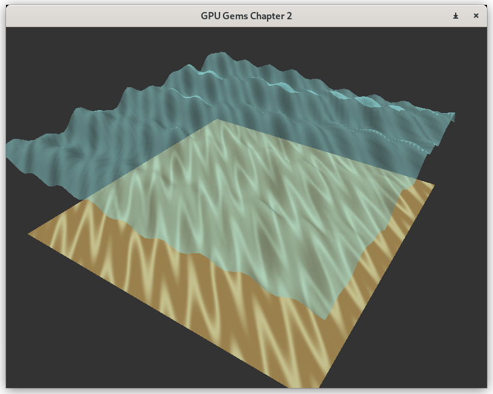

# Chapter 2

"[Rendering Water Caustics](https://developer.nvidia.com/gpugems/gpugems/part-i-natural-effects/chapter-2-rendering-water-caustics)" from GPU Gems

A fast implementation for plat ocean ground caustics.\
With two assumptions:
* Sun is directly above (`vec3(0.0, 1.0, 0.0)`)
* Ocean ground is lit be the vertex above

