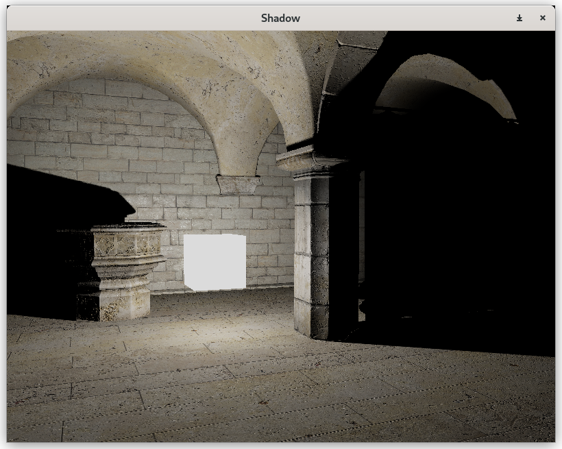

# Shadow

Cascaded Shadow Maps implementation.\
Including knowledge from:
* "GPU Gems" [Chapter 11. Shadow Map Antialiasing](https://developer.nvidia.com/gpugems/gpugems/part-ii-lighting-and-shadows/chapter-11-shadow-map-antialiasing).
* "GPU Gems 2" [Chapter 17. Efficient Soft-Edged Shadows Using Pixel Shader Branching](https://developer.nvidia.com/gpugems/gpugems2/part-ii-shading-lighting-and-shadows/chapter-17-efficient-soft-edged-shadows-using).

Omnidirectional Shadow Maps implementation.
* "GPU Gems" [Chapter 12. Omnidirectional Shadow Mapping](https://developer.nvidia.com/gpugems/gpugems/part-ii-lighting-and-shadows/chapter-12-omnidirectional-shadow-mapping)

