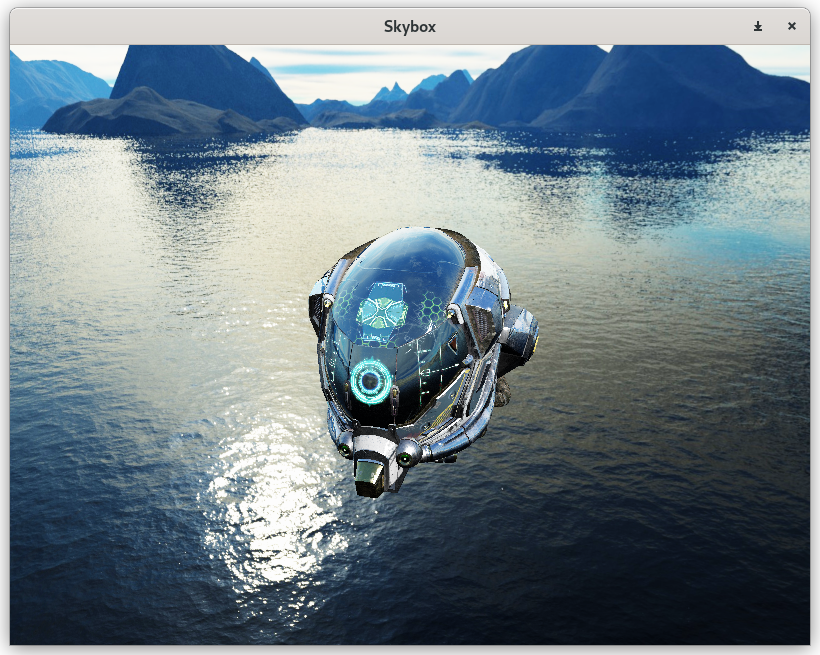
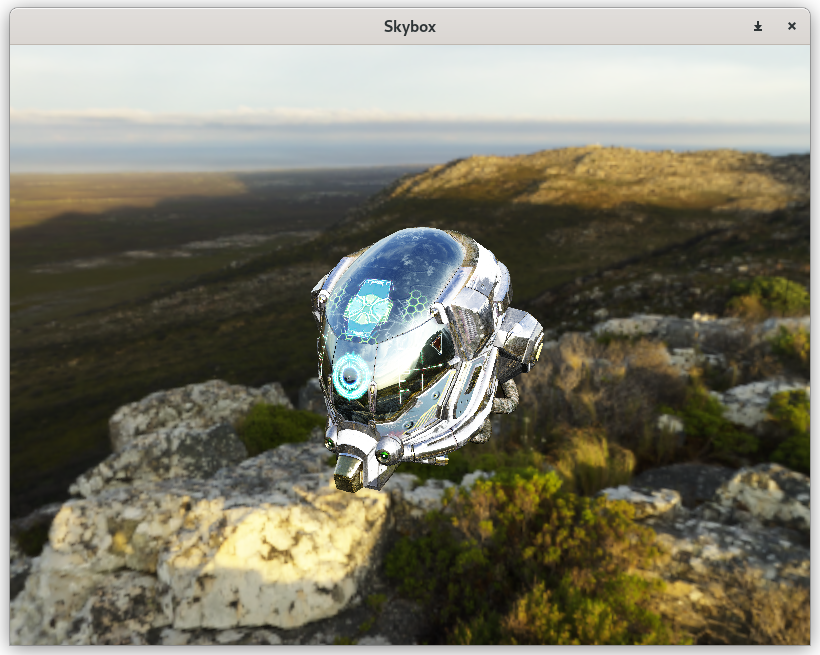

# Skybox

Skybox implemented with two formats:
* cubemap images (6 inputs)
* panorama image (1 input)

As well as an indirect light sampling for PBR.

Texture Sources:
* [skybox](https://learnopengl.com/Advanced-OpenGL/Cubemaps)
* [cape_hill_2k.hdr](https://polyhaven.com/a/cape_hill)
